# Kaiplan

A wedding planning SaaS: budget ledger, guest list and RSVP, drag-and-drop seating chart, vendor
tracker, milestone checklist, and a public wedding website for each couple. Built solo in three
months on Cloudflare Workers.

> [!IMPORTANT]
> **Status: retired 2026-06-11.** The Workers were retired that day, and the domains no longer
> serve the product; who controls them now is unconfirmed. It is published as an engineering
> record. The retirement commit replaced the three Worker entry points with 410-Gone stubs; they
> have been restored here so the project actually runs. Every infrastructure identifier (Hyperdrive
> IDs, D1 database IDs, Sentry DSNs, Turnstile keys, the PostHog project key) is a placeholder.

> [!NOTE]
> Built solo by **Angel Campa**: three months, one contributor, no CI. Published for reference
> and portfolio review under a no-license copyright; see [License](#license). Find me at
> [github.com/AngelCampa1](https://github.com/AngelCampa1).

| | |
|---|---|
| Language | TypeScript |
| Frontend | React 19, Astro |
| Backend | Hono |
| Platform | Cloudflare Workers |
| Database | Neon Postgres, Cloudflare D1 |
| ORM | Drizzle |
| Tooling | pnpm, Turborepo |

---

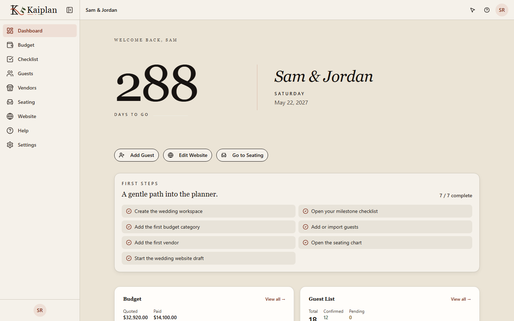
*The dashboard for a seeded demo wedding, captured from the local stack against seeded data.*

---

## Contents

- [What it did](#what-it-did)
- [Architecture](#architecture)
- [Seven decisions worth explaining](#seven-decisions-worth-explaining)
- [By the numbers](#by-the-numbers)
- [Testing](#testing)
- [Screenshots](#screenshots)
- [The marketing site is half the repository](#the-marketing-site-is-half-the-repository)
- [Repository map](#repository-map)
- [Documentation](#documentation)
- [Built with AI agents](#built-with-ai-agents)
- [Running it locally](#running-it-locally)
- [Who built this](#who-built-this)
- [License](#license)

## If you read one thing

Read the seating-chart integrity explanation under
[Seven decisions worth explaining](#seven-decisions-worth-explaining). A `jsonb` seating chart
cannot hold a Postgres foreign key, and a guest can decline from the public wedding website
without ever logging in. That combination is the single clearest example of how correctness got
enforced here without the database doing it for free. The
[design docs](docs/design-docs/) are the second stop: seven features, each specified before it was
built, with the reasoning left in place rather than cleaned up in hindsight.

---

## What it did

Kaiplan was a workspace for one wedding at a time, built for the couple and whoever was helping
them plan. A couple tracked their budget as quoted-against-paid per category, kept a guest list
with RSVP state and per-guest dietary notes, assigned guests to tables on a drag-and-drop seating
chart, logged vendor quotes and payments, worked through a milestone checklist grouped by how far
out the wedding was, and published a public wedding website where guests could read the details
and RSVP without ever creating an account. Every one of those six surfaces is covered below,
either in the [seven decisions](#seven-decisions-worth-explaining) that shaped how it was built or
in the [screenshots](#screenshots) that show it running.

---

## Architecture

Three Cloudflare Workers, two databases, one Durable Object.

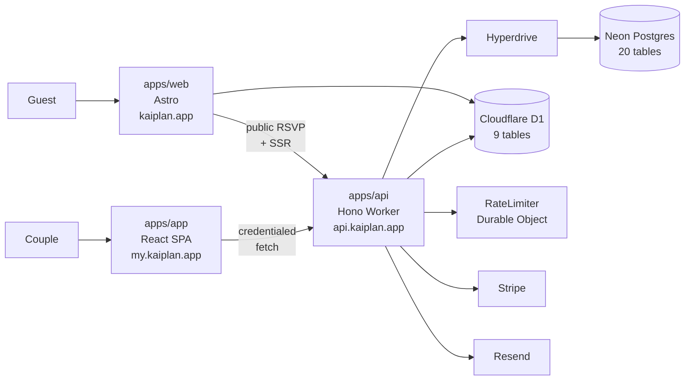

Every authenticated request passes through six layers before a handler sees it: security headers,
CORS, CSRF origin verification, a Durable Object rate limiter, session, then a wedding-access join
that resolves role and subscription in one query.

### Workspace packages

| Package | What it is | Deployed as |
|---|---|---|
| `apps/app` | React 19 SPA. TanStack Router and Query, Shadcn/UI, Tailwind 4. | Worker at `my.kaiplan.app` |
| `apps/api` | Hono API. Better Auth, Drizzle, Stripe, Resend. | Worker at `api.kaiplan.app` |
| `apps/web` | Astro marketing site and public wedding websites. | Worker at `kaiplan.app` |
| `packages/shared` | 53 zod schemas, plan matrix, domain constants. | |
| `packages/marketing` | Astro layouts, React islands, SEO toolkit. | |
| `packages/marketing-api` | Second Hono app on D1, mounted into Astro. | |
| `packages/knowledge` | Offering and pricing single source of truth. | |
| `packages/lead-magnet-pdf` | Markdown to PDF for lead magnets. | |

→ [ARCHITECTURE.md](portfolio/ARCHITECTURE.md) walks the request lifecycle, the three-layer
permission model, the two-database topology, and the cron pipeline

---

## Seven decisions worth explaining

The hardest problem here was not the drag-and-drop. A seating chart is a single `jsonb` document
whose seats hold foreign keys into the normalized `guest` table, and Postgres cannot enforce a
foreign key that lives inside a JSON blob. A guest who declines from the public wedding website,
without ever logging in, invalidates a seat the couple assigned an hour earlier.

**The seating chart is a foreign key Postgres cannot enforce.** The chart is one `jsonb` column per
wedding ([`seating-schema.ts`](apps/api/src/db/seating-schema.ts)), and every seat inside it holds
a `guestId` pointing at a row in the normalized `guest` table. A `REFERENCES` clause cannot reach
inside a JSON blob, and neither can a unique index, so four mechanisms stand in for them:

1. A zod refinement rejects a chart that seats the same guest twice
   ([`seating-schemas.ts:94`](packages/shared/src/seating-schemas.ts)).
2. On `PUT`, the API re-reads every referenced guest inside the transaction and refuses the save if
   one belongs to another wedding or has declined
   ([`seating.ts:127`](apps/api/src/routes/seating.ts)).
3. On `GET`, it drops assignments whose guest has since been deleted or declined, so a stale chart
   repairs itself on read instead of rendering a seat for someone who is not coming
   ([`seating.ts:83`](apps/api/src/routes/seating.ts)).
4. Seven call sites strip a guest out of the chart in the same transaction that deletes them or
   records their decline ([`seating-cleanup.ts`](apps/api/src/lib/seating-cleanup.ts)). Six are in
   [`guests.ts`](apps/api/src/routes/guests.ts), behind a session. The seventh is
   [`wedding-website.ts:680`](apps/api/src/routes/wedding-website.ts), reached from the public RSVP
   handler at [`wedding-website.ts:1450`](apps/api/src/routes/wedding-website.ts), a `POST` that
   carries a rate limiter and a Turnstile check but **no session middleware at all**, because the
   guest declining has no account. That is the call site that matters: the one path into this
   invariant that no login guards.

The save replaces the whole document, so two concurrent `PUT`s would silently lose one.
`lockSeatingChart` takes `SELECT ... FOR UPDATE` on the chart row and on the wedding row, because a
wedding that has never been saved has no chart row to lock.

**Cron jobs run serially, and that is deliberate.** The API Worker runs five maintenance jobs
nightly. They share a single `pg.Pool({ max: 1 })` behind Hyperdrive, so running them concurrently
made the later jobs time out waiting for the one connection. They execute in a `for` loop, each
wrapped in `withDbRetry` and its own try/catch, so a single failure neither aborts the run nor
skips the rest. See [`apps/api/src/index.ts:653`](apps/api/src/index.ts).

**Permissions are enforced three times, on purpose.** A DB `CHECK` constraint on the role column, a
route middleware that resolves membership in one join, and a `requireWriter(c)` guard at every
mutating handler. Each catches a different class of bug: a bad migration, a route tree that forgot
authz, and a read-authorized user hitting a write endpoint. See
[`apps/api/src/db/schema.ts:70`](apps/api/src/db/schema.ts).

**Two databases, chosen rather than inherited.** Postgres for transactional product data that
needs joins, cascades, and constraints. D1 for marketing and email-preference data that needs edge
reads and tolerates eventual consistency. Both the product Worker and the marketing Worker bind the
*same* D1. That shared binding is how a transactional product email honors an unsubscribe made from
a marketing footer.

**Rate limiting is a Durable Object.** `RateLimiter` implements a fixed-window counter with
per-endpoint budgets composed as Hono middleware: sign-in 10/min, public API 60/min, and four
others. Keys prefer `CF-Connecting-IP` over the spoofable `X-Forwarded-For`. See
[`apps/api/src/lib/rate-limit.ts`](apps/api/src/lib/rate-limit.ts).

**Uploads never touch the Worker.** The client asks the API for an upload intent, the API mints a
Cloudflare Images direct-upload URL, and the browser uploads straight to Cloudflare. The Images
token never reaches the client and user bytes never transit the Worker. The threat model is written
down in [`docs/image-upload-security-policy.md`](docs/image-upload-security-policy.md).

**The configuration has its own tests.** Config drift is a failure mode unit tests structurally
cannot catch, so there are 13 meta-tests asserting the vitest excludes, the wrangler bindings and
custom domains, and that the pricing documentation still agrees with `PLAN_PRICING` in
`packages/shared`. A stale doc is a red build.

---

## By the numbers

<!-- LOC:      git ls-files | grep -E '\.(ts|tsx|astro|css|sql|mjs)$' | xargs cat | wc -l -->
<!-- tests:    git ls-files | grep -cE '\.(test|spec)\.(ts|tsx)$' -->
<!-- cases:    git ls-files | grep -E '\.(test|spec)\.(ts|tsx)$' | xargs grep -cE '^\s*(it|test)(\.\w+)?\(' | awk -F: '{t+=$2} END{print t}' -->
<!-- History is the one row you cannot re-derive here: this is a snapshot, so it -->
<!-- carries only the commits needed to publish it. The figure comes from the private full-history repo. -->

| | |
|---|---|
| Lines of code | **230,851** across 981 files |
| Source vs test | 89,693 source, 141,158 test. **Test code outweighs source 1.57 : 1.** |
| Test files | **425** |
| Test cases | **6,929**, with 13,758 assertions |
| Coverage gate | **95% per file** (lines, functions, branches, statements) in all 8 packages |
| E2E | **24 Playwright specs, 96 cases**, across 3 device profiles |
| API surface | 79 endpoints across 14 route modules |
| Data | 20 Postgres tables / 25 migrations. 9 D1 tables / 14 migrations. |
| Workspace packages | **8** |
| History | 469 commits, 2026-04-07 to 2026-07-08, 1 contributor |

The History row is the one figure you cannot re-derive here. This is a snapshot of the final tree,
not the original repository, so it carries only the commits needed to publish it, and the
469-commit history stayed in a private repo because it contains vendored private dependencies from
another project. Every other number on this page comes from this tree, and the commands to
re-derive them are in the source of this file.

The coverage number is `perFile: true`, not a repo average. A repo-average gate lets one untested
module hide behind a well-tested one. Per file means every file clears the bar alone. The exclusion
list is written out in full in [TESTING.md](portfolio/TESTING.md), because a 95% claim is only
believable if you can see what was left out. The largest exclusion is `wedding-website.ts`: 1,559
lines, never backfilled, and the same module as the unauthenticated RSVP handler above. The
source-versus-test split itself is [above in this table](#by-the-numbers).

→ [METRICS.md](portfolio/METRICS.md) gives every number on this page the command that produced it,
and sources the two that come from the private full-history repository instead

---

## Testing

Every task here followed test-first development: a failing test before any implementation, then
the minimal code to pass it. The result shows up directly in the [source-versus-test
split](#by-the-numbers) above and in the 95%-per-file coverage gate that sat in front of every
commit through husky hooks, since there was never a CI workflow to run it instead.

The E2E suite does not mock the backend. `pnpm run e2e:browser` boots Docker Postgres, the real API
Worker, the marketing API, the SPA, and the Astro site, then runs 24 Playwright specs across three
device profiles, desktop Chromium, iPhone 12, Pixel 7, with `@axe-core/playwright` asserting
zero accessibility violations in the same runs.

`packages/marketing-api`'s integration suite runs outside every check named in this repo: its
`signup.integration.test.ts` › "claims duplicate lead magnet retries so concurrent requests send
once" failed on both of two consecutive local runs, a race in the test setup left for the owner
rather than patched quietly. `wedding-website.ts`, the module holding the unauthenticated RSVP
handler discussed above, is the one route file excluded from coverage and never backfilled.

→ [TESTING.md](portfolio/TESTING.md) has the full exclusion list, the local E2E harness, and how
the seven-stage `pnpm run verify` gate is ordered

---

## Screenshots

<table>
<tr>
<td width="50%" valign="top">
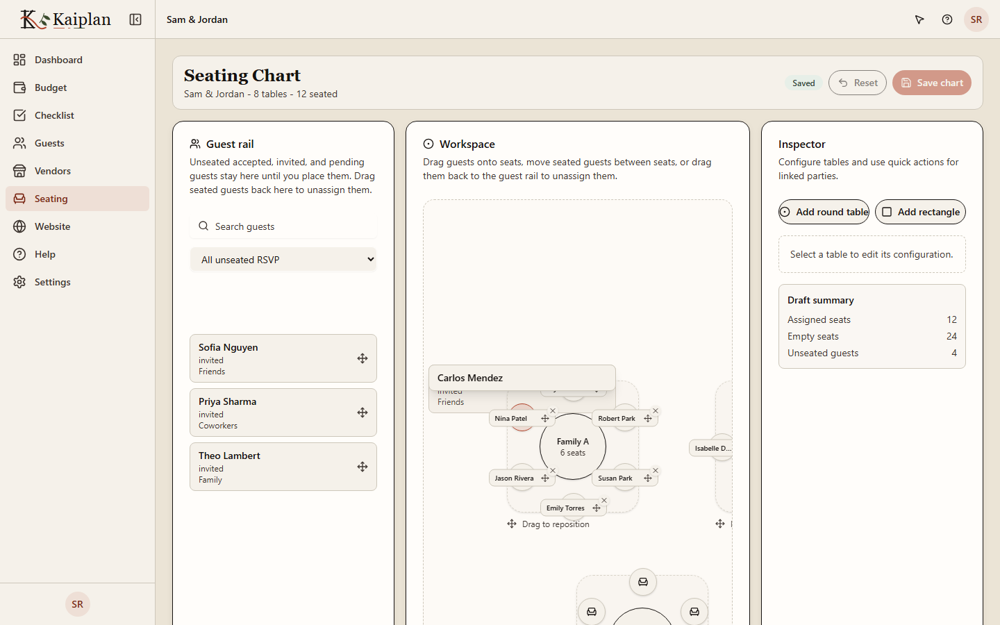
<br>
<strong>Seating chart.</strong> A guest held mid-drag over the canvas. Eight tables, twelve seated.
This is the screen the <code>jsonb</code> problem above is about.
</td>
<td width="50%" valign="top">
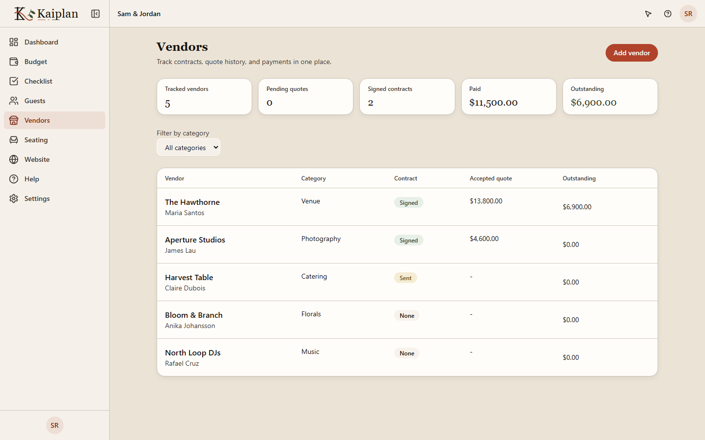
<br>
<strong>Vendor tracker.</strong> Accepted quotes, logged payments, and the balance still owed per
vendor.
</td>
</tr>
<tr>
<td width="50%" valign="top">
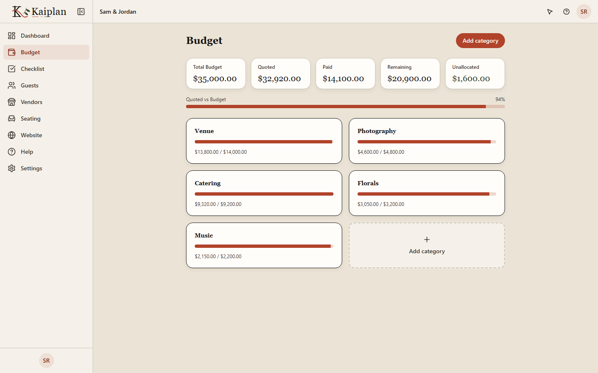
<br>
<strong>Budget ledger.</strong> Categories, quoted against paid, progress.
</td>
<td width="50%" valign="top">
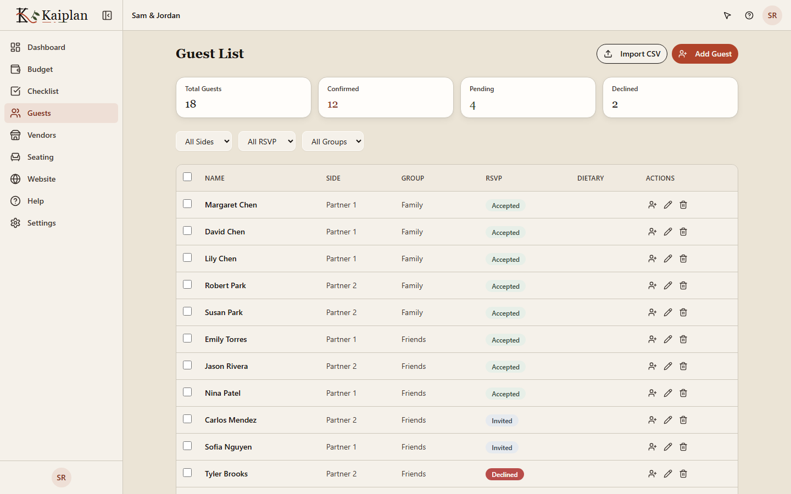
<br>
<strong>Guest list.</strong> RSVP states, sides, groups. A declined row here is what invalidates a
seat.
</td>
</tr>
<tr>
<td width="50%" valign="top">
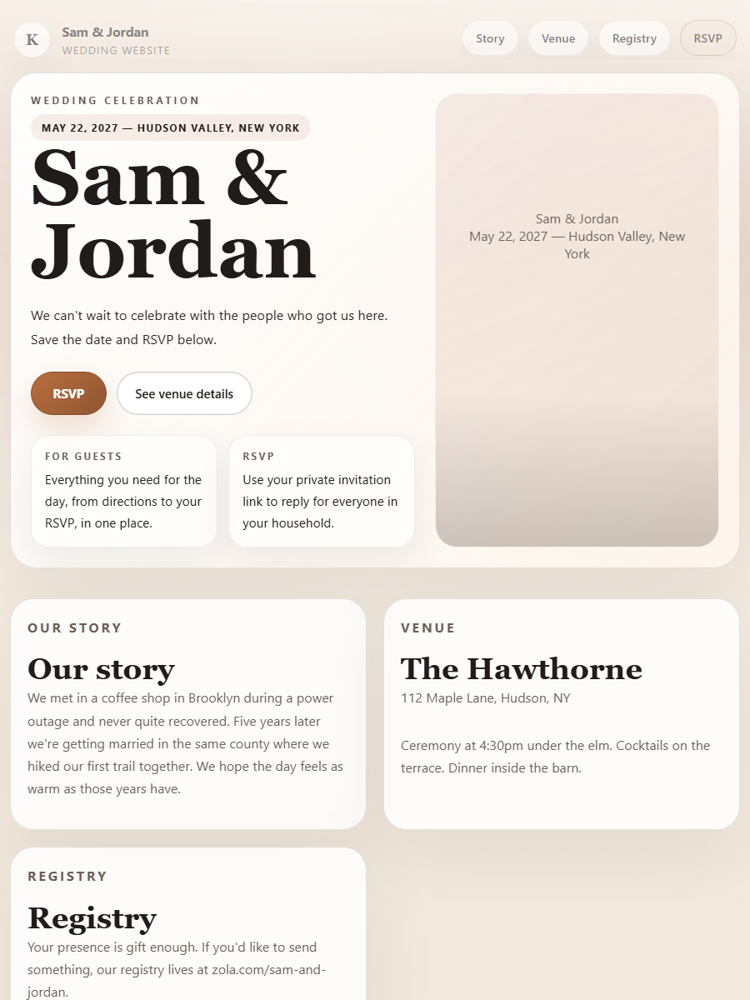
<br>
<strong>Wedding website.</strong> The couple-facing public site, and where a guest declines without
ever logging in.
</td>
<td width="50%" valign="top">
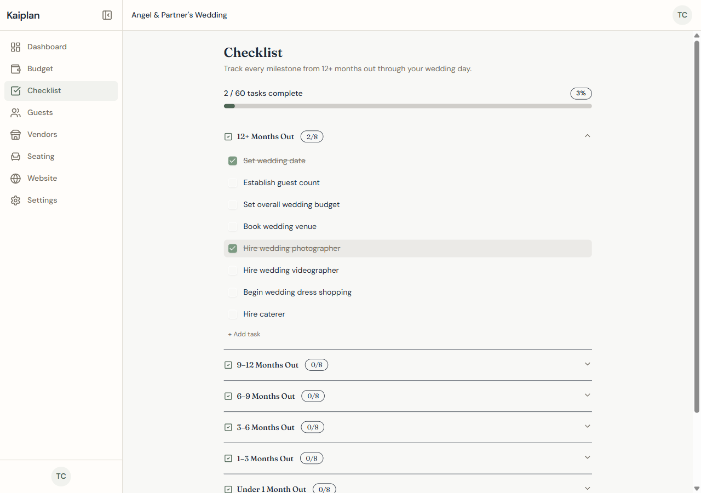
<br>
<strong>Milestone checklist.</strong> Sixty tasks across eight timeframes, two already checked off,
the one feature named in the pitch above with no screen until this pass.
</td>
</tr>
</table>

All captured from a real local stack: Docker Postgres, the API Worker, the marketing API, the SPA,
and the Astro site, all running, no mocks. See
[`scripts/capture-screenshots-v2.ts`](scripts/capture-screenshots-v2.ts). The milestone-checklist
capture is the exception: pulled from an earlier local audit session rather than the v2 harness,
which is why it does not share that script's file naming.

---

## The marketing site is half the repository

Five of the eight packages exist to serve `kaiplan.app`, not the product. That is not a footnote:
`packages/marketing` alone carries 111 test files and 2,527 cases, more than any other package
including the API.

`apps/web` renders **247 Markdown content entries** across six Astro collections: 133 guides, 29
listicles, 26 head-to-head comparisons, 24 pricing breakdowns, 19 alternative-to pages, and 16 lead
magnets. Every one is written prose, not a template filled from a keyword list.

<table>
<tr>
<td width="50%" valign="top">
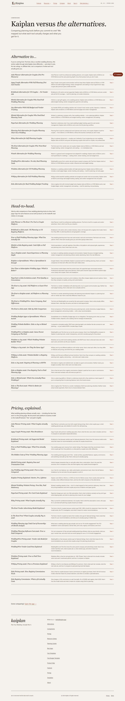
<br>
<strong>The comparison hub.</strong> 69 entries in three collections, routed by
<code>compare/{alternatives,versus,pricing}/[slug].astro</code>.
</td>
<td width="50%" valign="top">
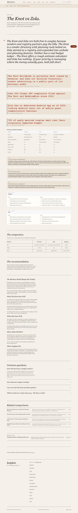
<br>
<strong>One entry, in full.</strong> Sourced statistics, a feature table, pros and cons per tool,
and a stated recommendation. Not a doorway page.
</td>
</tr>
<tr>
<td width="50%" valign="top">
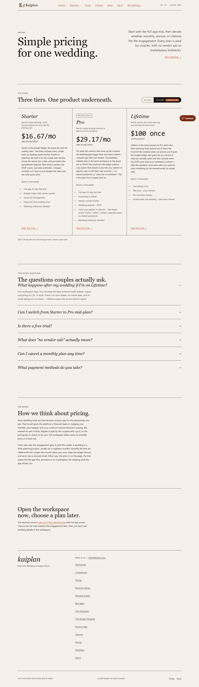
<br>
<strong>Pricing.</strong> <a href="apps/web/src/pages/pricing.astro.test.ts"><code>pricing.astro.test.ts</code></a>
asserts the rendered tiers against <code>kaiplanPricingFacts</code> in <code>packages/knowledge</code>,
so the page and the source of truth cannot drift apart quietly.
</td>
<td width="50%" valign="top">
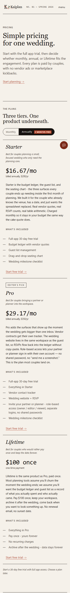
<br>
<strong>The same page at 390px.</strong> One of three Playwright device profiles;
<code>iphone-12</code> and <code>pixel-7</code> run every E2E spec.
</td>
</tr>
</table>

The prices shown are the annual rate, because the page defaults to the annual tab. List price was
$20/mo Starter, $35/mo Pro, $100 once for Lifetime.

The 16 lead magnets are the one collection that leaves the site: `packages/lead-magnet-pdf` renders
the same Markdown to a PDF, and `apps/web/d1/migrations/0009_lead_magnet_delivery_state.sql` tracks
delivery on D1. [The free budget template page](portfolio/screenshots/marketing-lead-magnet.png) is
a full-page capture of one of them, long enough that it is linked rather than embedded.

Inside the product, the same content discipline shows up as a guided-tour system rather than a
tooltip layer:

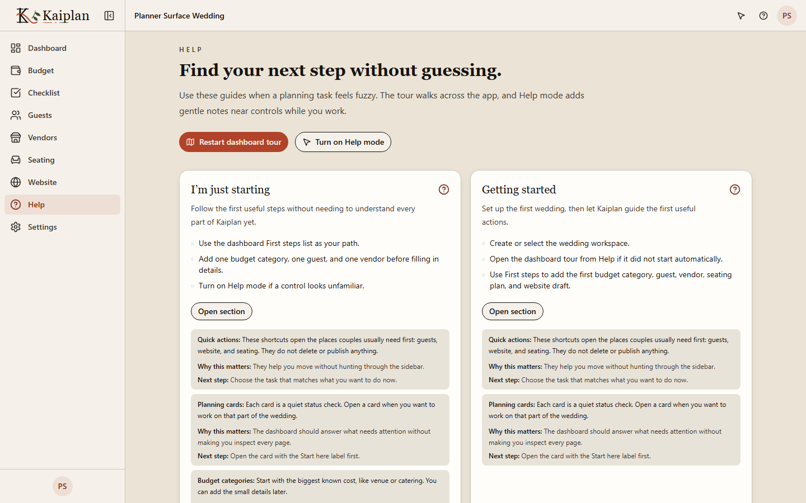

**Help mode.** Every note is a Quick actions / Why this matters / Next step triple, authored
alongside the control it annotates rather than bolted on afterwards.

---

## Repository map

```text
apps/api/             Hono API Worker. 79 endpoints, 14 route modules, 20 Postgres tables
apps/app/              React 19 SPA. TanStack Router and Query, Shadcn/UI
apps/web/              Astro site, public wedding websites, 247 Markdown content entries
packages/              8 workspace packages (shared, marketing, marketing-api, knowledge, …)
e2e/                   24 Playwright specs across 3 device profiles
scripts/               Build, deploy, and capture tooling. 22 of 41 modules have tests
portfolio/             The retrospective write-ups, indexed in portfolio/README.md
docs/                  Working notes: design docs, roadmap, runbook, deploy steps
```

## Documentation

`portfolio/` holds the retrospective write-ups: finite, addressed to a reader, every claim
traceable to a file in this tree. `docs/` is the working residue, left as it was found: plans, a
runbook, a launch checklist with boxes still unchecked.

→ [portfolio/](portfolio/README.md) indexes every retrospective document with a one-line summary
and its length
→ [docs/](docs/) holds the design docs, the roadmap, the operational runbook, and the deploy steps

---

## Built with AI agents

This repository was built end-to-end with Claude Code, under the workflow rules in
[CLAUDE.md](CLAUDE.md) and [AGENTS.md](AGENTS.md). Both files, and the [`.claude/`](.claude/)
directory, are committed on purpose and reviewed like source: they are not scrubbed before
publishing, because the AI-assisted process is disclosed, not a liability to hide.

No commit-level attribution of human-versus-agent authorship survives the squash: this snapshot
carries only the commits needed to publish it, and the private full-history repository (469
commits, 1 human contributor) has no co-author trailers to report even there. The clearest
fingerprint the workflow left in this tree is structural, not a commit count: `CLAUDE.md` mandates
a failing test before any implementation, and the 95%-per-file coverage gate enforced that
discipline through `husky` on every commit, which is why test code outweighs source 1.57 : 1
across this tree, a ratio a repo built the usual way around would not produce by accident.

One concrete gate the workflow ran that a human alone would not have bothered to write:
`scripts/docs-source-of-truth.test.ts` imports `PLAN_PRICING` straight from `packages/shared` and
fails the build if `docs/pricing.md` disagrees with it. A stale pricing doc is a red build, not a
documentation nit someone notices later.

---

## Running it locally

Needs Node 22, pnpm 10, and Docker (for the E2E Postgres).

```bash
pnpm install
pnpm exec turbo dev            # everything
pnpm --filter @kaiplan/app dev # SPA only, :3030
pnpm --filter @kaiplan/api dev # API only, :5030
```

The full E2E stack needs no credentials and no real service accounts. Copy one example file, then
let Playwright boot all four services itself. `scripts/local-e2e-config.ts` synthesizes every other
variable, including the auth secret and the Stripe price IDs.

```bash
cp apps/web/.dev.vars.example apps/web/.dev.vars
pnpm run e2e:browser
```

That one file is not optional. Wrangler reads worker vars from `.dev.vars`, not from the shell, so
without it the Astro site falls back to its production `ALLOWED_ORIGIN` and every same-origin form
POST comes back 403.

Deploying does need real credentials and real Cloudflare resource IDs, since the ones in the
wrangler configs are placeholders. See
[`docs/production-env-vars-step-by-step.md`](docs/production-env-vars-step-by-step.md).

```bash
pnpm run verify   # lint, typecheck, coverage, scripts, build, link audit, e2e
```

---

## Who built this

Angel Campa, solo. Three months, one contributor, no CI, every quality gate run locally through
husky hooks. I was a Principal SDET at the time, which is most of the explanation for why there is
more test code here than source code.

Find me at [github.com/AngelCampa1](https://github.com/AngelCampa1).

---

## License

Copyright (c) 2026 Angel Campa. All rights reserved.

Published for reference and portfolio review. No license is granted to use, copy, modify, or
distribute this code.

Built with [Shadcn/UI](https://ui.shadcn.com/) (MIT).
