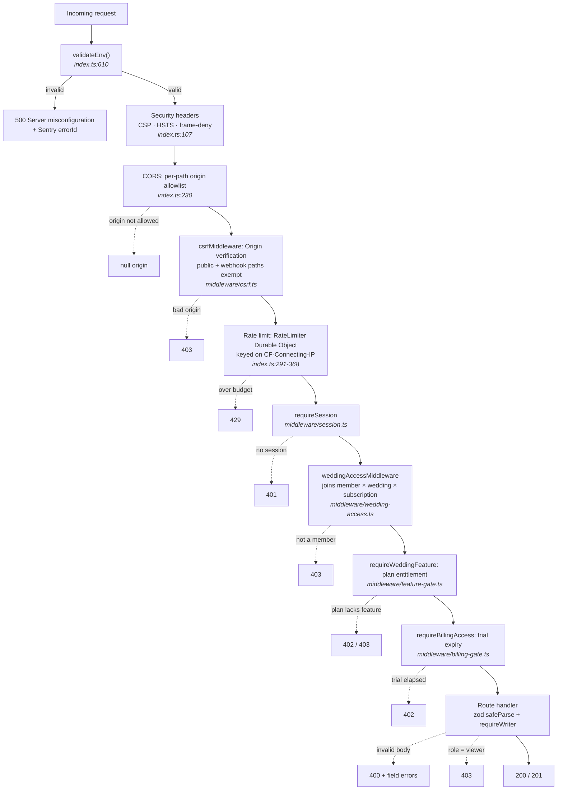
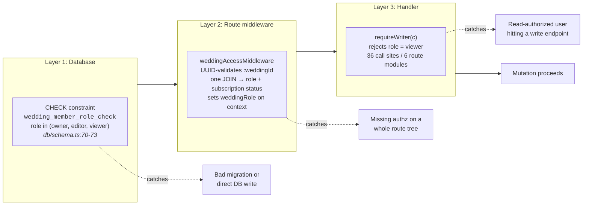
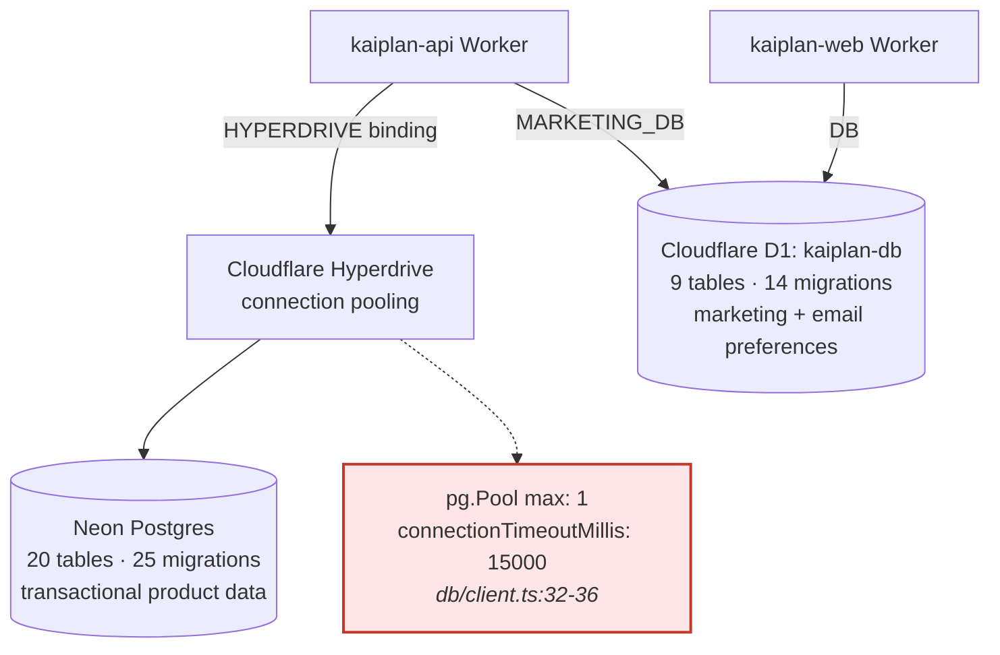
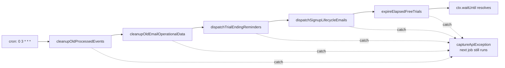
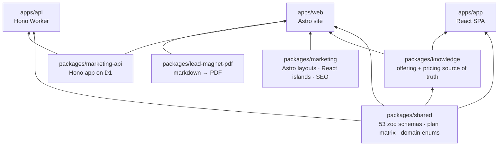

# Architecture

Kaiplan ran entirely on Cloudflare's edge: three Workers, two databases, one Durable Object. This
document explains how a request moves through the system and why the parts are shaped the way they
are.

> **Reading the API entry point.** The product was retired on 2026-06-11 (commit `b5372ed`), which
> replaced the Worker entry points with 410-Gone stubs. They were restored for this archive, so
> `apps/api/src/index.ts` is the real composition root again. If you are browsing a commit between
> `b5372ed` and the restore, use `git show b5372ed^:apps/api/src/index.ts` instead.

---

## 1. Request lifecycle

Every authenticated API request passes through six layers before a handler sees it. Order matters:
CORS must precede CSRF so preflights are answered before origin checks run, and rate limiting must
precede session lookup so an unauthenticated flood never reaches the database.

Two details worth calling out:

**Errors carry a correlation ID.** A single `app.onError` captures the exception to Sentry with a
scrubbed path, then returns the Sentry event ID to the client in both the response body and an
`X-Kaiplan-Error-Id` header, exposed through CORS via `exposeHeaders`. A user reporting "it broke"
can quote an ID that maps to a stack trace. Error messages themselves are suppressed in production
and surfaced in development.

**Rate limits are per-endpoint, not global.** Six budgets: sign-in 10/min, sign-up 10/min,
forgot-password 5/min, change-password 5/min, auth catch-all 20/min, public API 60/min. The key
function deliberately prefers `CF-Connecting-IP` over the spoofable `X-Forwarded-For`.

**Routing is explicit, not implicit.** Route modules are factory functions mounted as sub-`Hono`
apps and dispatched by explicit URL rewriting rather than nested `app.route()` calls. Hono's trie
matches left-to-right, so `/:weddingId/website/*` has to be declared before `/:weddingId/*` or the
wildcard swallows it. Explicit dispatch makes that ordering visible instead of
load-bearing-but-invisible.

---

## 2. The three-layer permission model

A wedding is the tenant. Members hold one of three roles, and each role is enforced at a different
depth, because each layer catches a class of bug the others structurally cannot.

The middleware resolves membership, wedding, and the **owner's** subscription in a single join.
Entitlement follows the wedding owner, not the member making the request, so an invited editor
inherits the owner's plan rather than needing their own.

`requireWriter` is not shared: it is declared six times, once per route module, and the six copies
are identical. Extracting it is a five-minute change that never got made, and it is the kind of
duplication that stays harmless right up until one copy is edited and the others are not.

Above this sits an append-only `audit_log`, written best-effort via `recordAuditEventBestEffort` so
a logging failure never fails a user's request. It probes for table existence first, which keeps it
safe across migrations.

---

## 3. Two databases, on purpose

**Postgres** holds everything transactional: weddings, members, guests, budget categories and items,
vendors with nested quotes and payments, checklist tasks, seating charts, subscriptions. It needs
real joins, foreign keys with cascade semantics, and `CHECK` constraints.

**D1** holds marketing signups, pricing clicks, survey responses, referrals, lead-magnet downloads,
and, critically, email preferences and unsubscribe tokens. Both the product Worker and the marketing
Worker bind the *same* D1 instance. That shared binding is the mechanism by which a transactional
product email honors an unsubscribe made from a marketing footer. Migrations live in
`apps/web/d1/migrations` and are referenced from both wrangler configs.

The `max: 1` pool is highlighted above because it is not incidental. It dictates the design of the
cron pipeline below.

---

## 4. The cron pipeline, and why it is serial

The API Worker runs five maintenance jobs daily at 03:00 UTC. They execute strictly in series.

Every job is wrapped in `withDbRetry` (2 retries, transient failures only) and its own
`try`/`catch`, so one failure neither aborts the run nor silently skips the rest.

The serial ordering is a direct consequence of the connection pool. From
`apps/api/src/index.ts:653`:

> Run maintenance jobs sequentially. They share a single pg Pool (`max: 1`) backed by Hyperdrive, so
> concurrent execution causes the later jobs to time out waiting for the one connection. Each job is
> isolated so a single failure does not skip the others.

`withDbRetry` inspects both `error.message` and `error.cause.message`, because Drizzle wraps driver
errors one layer deep. A retry predicate reading only the top-level message would miss every
transient Hyperdrive failure.

The marketing Worker runs its own hourly cron for survey reminders, against D1, independently.

---

## 5. Package graph

`packages/shared` is the spine. It owns the `BILLING_PLAN_FEATURES` matrix, so changing what a plan
includes propagates in one edit to the feature-gate middleware, the paywall UI, and the public
pricing page. They cannot drift, because they read the same constant.

Turborepo wires the build order: `build` and `test:coverage` both declare `dependsOn: ["^build"]`,
which is what forces `shared` to compile before anything that imports it.

---

## 6. Provenance and scope

- **The AI customer-support integration** was removed before this archive was published. Its route
  modules, nonce store, and vendored dependency are not in this tree.
- **Every infrastructure identifier is a placeholder**: Hyperdrive ID, D1 database ID, Sentry DSN,
  and Turnstile key alike, in every wrangler config. The configs are shaped correctly and pass the
  deploy validators, so a reader can inspect them safely; they need real values to deploy anywhere.
- **The seating editor keeps local optimistic state and flushes with a single `PUT`.** There was no
  websocket or SSE channel, no feature flags, and no i18n.
- Quality gates ran locally through husky hooks throughout development. See
  [TESTING.md](TESTING.md) for what that bought and what it cost.
